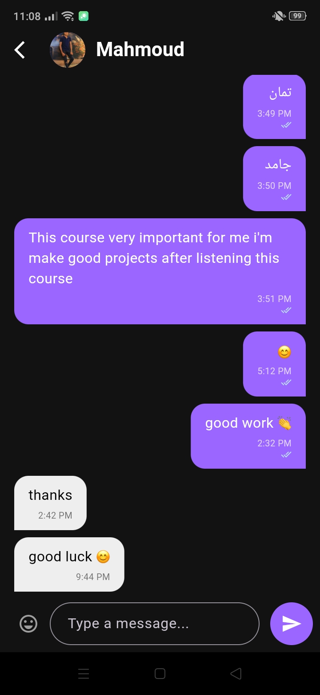

# 🎥 SkillTok – Social Video Sharing App

---

<p align="center">  </p> <p align="center"> <b>A modern social video sharing application built with Flutter & Firebase</b> </p>

**SkillTok**  is a social media mobile application that allows users to upload, share, and interact with short videos in a smooth and engaging way.

The app focuses on real-time interaction, privacy control, personalization, and performance optimization — delivering a modern social experience powered by Firebase.


> This README is structured to help contributors, reviewers, and new developers quickly understand
> and run the project.

---

## 🔑 Highlights

- 🎥 Upload & Share Videos

- 💬 Comment & Engage with Posts

- ❤️ Like Posts & Follow Users

- 📌 Save Important Posts

- 🔒 Private Posts & Private Accounts

- 💬 Real-Time Chat System

- 🔔 Push Notifications (Firebase Cloud Messaging)

- 🌐 Multi-language Support

- 🌙 Light & Dark Mode

- 😊 Emoji Support

- ⚡ Smooth Performance & Optimized UI 

---

## 📸 Screenshots / Preview

|               Add post                   |              Profile                  |                Chat              |
|:----------------------------------------:|:-------------------------------------:|:--------------------------------:|
|  |  |  |

---

## 🏗️ Architecture Overview
The project follows a feature-based clean structure for better scalability and maintainability.
```
lib/
├─ core/
│  ├─ services/
│  ├─ utils/
│  ├─ theme/
│  └─ constants/
│
├─ features/
│  ├─ auth/
│  ├─ home/
│  ├─ upload/
│  ├─ chat/
│  ├─ notifications/
│  ├─ profile/
│  └─ settings/
│
├─ widgets/
└─ main.dart
```

This layout helps keep features self-contained and easier to test.

---

## 🧩 Tech Stack

- Flutter & Dart
- Firebase Authentication
- Cloud Firestore
- Firebase Storage
- Firebase Cloud Messaging (FCM)
- Bloc / Cubit (State Management)
- GetIt (Dependency Injection)
- Shared Preferences (Local Storage)
- cached_network_image
- image_picker
---

## 🎯 Design & UX Decisions

🎨 Clean, modern UI inspired by short-video platforms
The interface was designed to be minimal and distraction-free, focusing on content consumption. Clear hierarchy, balanced spacing, and modern typography enhance usability and visual comfort.

⚡ Optimized feed scrolling & video performance
The feed is optimized using efficient state management and lazy loading techniques to ensure smooth scrolling and seamless video playback without performance drops.

🔄 Real-time Firestore streams for comments & chat
Firestore streams are used to provide instant updates for comments, likes, and chat messages, ensuring a dynamic and interactive social experience.

🔐 Advanced privacy settings for users & posts
Users can set their accounts or individual posts to private, giving them full control over their visibility and interactions.

🌙 Centralized theme management (Light / Dark)
A centralized theme system allows smooth switching between Light and Dark modes while keeping the UI consistent and scalable.

🌍 Built-in localization support
The app supports multiple languages with structured localization files, allowing users to switch languages dynamically.

🚀 Efficient state management to reduce unnecessary rebuilds
Bloc/Cubit architecture is used to separate business logic from UI, minimizing rebuilds and improving overall performance and maintainability.

## 🔔 Notifications System
---
SkillTok uses Firebase Cloud Messaging (FCM) to deliver real-time push notifications for:
- Likes
- Comments
- New Followers
- Chat Messages

Notifications enhance engagement and keep users updated instantly.

## 🚀 Getting Started (Developer)
### 📋 Prerequisites

- Flutter SDK (stable)
- Android Studio or VS Code
- Firebase project configured

### Quick setup

```bash
# Clone
git clone https://github.com/AzaKhaled/Skilltok.git
cd Skilltok 

# Install
flutter pub get

# Run
flutter run
```

## 🧪 Testing

- Unit tests: `flutter test`
- Widget/integration tests: `flutter drive` / `integration_test`

Consider adding mocks for Firestore and Auth when writing unit tests.

---

## 🛠️ Common commands

```bash
# Analyze
flutter analyze

# Format
flutter format .

# Run on device
flutter run

# Build
flutter build apk --release
```

---

## 📣 Contributing

1. Fork the repo
2. Create a feature branch
3. Open a PR with description & screenshots

Please follow the existing style and write tests for new logic.

---

## 📬 Contact

azakhaled813@gmail.com


---
